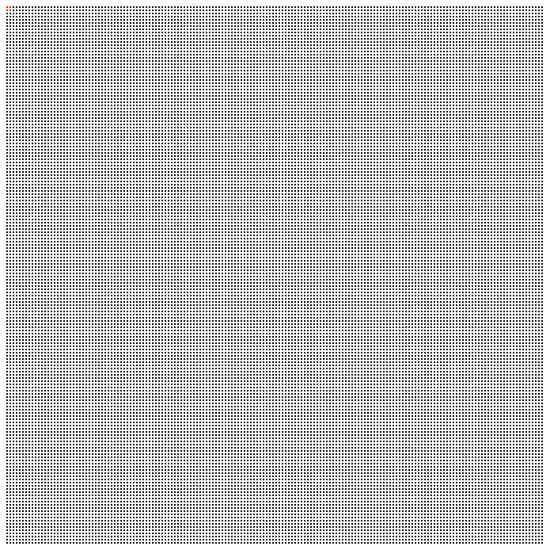
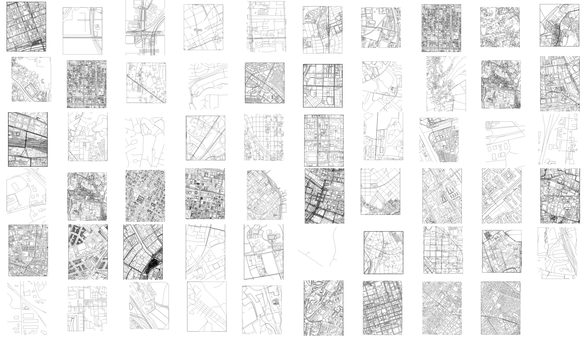

# Concepts / Themes

## List

Some of the major concepts/themes I want to address are listed below. My goal is to develop some kinds of visual outputs (e.g. maps, illustrations, data art, etc) that comment on these various aspects:

* [ ] Academic publishing
* [ ] Academic funding (e.g. grant funding models)
* [ ] Data sharing
* [ ] Reproducibility / reproducible research
* [ ] Scientific software
* [ ] Diversity / Inclusivity in Science (e.g. gender)
* [ ] Peer review
* [ ] Data /research archiving
* [ ] STEM /STEAM education
* [ ] Public access / understanding of science
* [ ] Career paths in Science (e.g. undergrad --> grad --> postdoc --> professor)

## Overarching concepts:
I'm interested to show the spatial aspects of open science. For example, *where* are the physical locations are all the closed source publishers that are monetizing the access to knowledge? or where on the web is open science playing out? I'd like to use the idea of "mapping" to stitch this together.

***

# Pages

## The Proportion of Open (academic publishing):

Of the ### milion scientific publications that exist only X.X million are open access. 

## Academic Publishing (academic publishing):

*Where* are the physical locations are all the closed source publishers that are monetizing the access to knowledge? and what if instead of being the places that made knowledge difficult to access, they instead served up knowledge? 

> By the year 2016, there were over ### million scientific papers published. Only 1.5 million of those were open access - the other #.# million papers were only available by subscription. Starting in the year 2020, the entirety of the scientific literature was made free and accessible to the public. The publishing houses that once monetized scientific knowledge have been disintegrated and converted into server farms and databases, now providing the world with access to scientific papers, software, and datasets. These are some of the locations that once made knowledge difficult to access, but now help to distribute it.

## Data Archiving

What does data archiving look like in the future? How do we use print to archive digital things?

