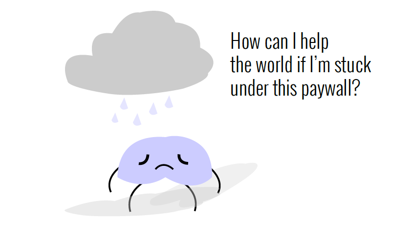

# Open Science observations

## About
<!--The Open Science Observations is a book and web based feature that attempts to catalog some of the artifacts of the dominant cultural paradigms in science. Some examples include the cultures around academic publishing, academic funding, data sharing, diversity and inclusivity in science, etc. The project is a sort of "capstone" of my Mozilla Science Fellowship to sum up the current perspectives on science and what aspects of science could be improved, how those aspects might be improved, and why those aspects are broken.-->

The content of the Open Science Observations is about what I've come to learn about science/open science over the last year, and about collecting the thoughts, feelings, and facts about the world of science as we know it. I intend to [crowdsource these thoughts, feelings, and facts in an open survey](http://goo.gl/forms/oE720zs7m56sScl33) to incorporate as much of the community's views as possible.

## Contributing
### Survey 

As mentioned in the [About Section](##about) - I'm collecting your thoughts, ideas, and facts about the dominant cultural paradigms in science. If you'd like to contribute, please fill out [the survey here](http://goo.gl/forms/oE720zs7m56sScl33).

### Graphic Design/layout
I definitely will need some help with layout. Also my eye for colors could use some help. 

## Concepts / Themes

Some of the major concepts/themes I want to address are listed below. My goal is to develop some kinds of visual outputs (e.g. maps, illustrations, data art, etc) that comment on these various aspects:

* [ ] Academic publishing
* [ ] Academic funding (e.g. grant funding models)
* [ ] Data sharing
* [ ] Reproducibility / reproducible research
* [ ] Scientific software
* [ ] Diversity / Inclusivity in Science (e.g. gender)
* [ ] Peer review
* [ ] Data /research archiving
* [ ] STEM /STEAM education
* [ ] Public access / understanding of science
* [ ] Career paths in Science (e.g. undergrad --> grad --> postdoc --> professor)

I will be documenting the concepts as they develop as part of the story in the [CONCEPTS.md file](CONCEPTS.md).

## Format:
I'm envisioning both a print and webbased feature of the content. These are initial ideas that I could definitely use some help with (e.g. production, layout, etc.)
### Print
* hardcover
* 15 - 20 pages/concepts

### Web
* interactive web page - scrolly?
